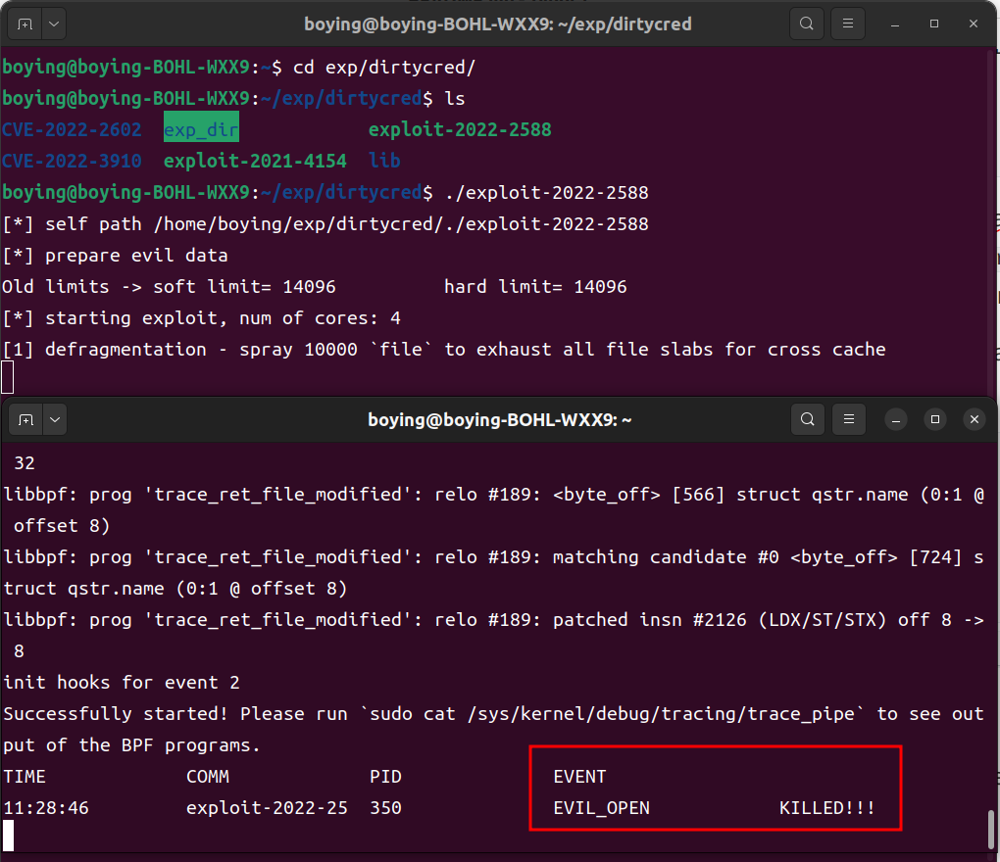

# KShield

> **TODO**
>
> - Fix the performance test section (directory issue in scripts).
> - Attempt to create a Docker image to package both the functional and performance test environments.

**Our paper:** kShield: An eBPF Runtime Defense Framework for Linux Kernel Privilege Escalation Attacks

- `1-func-test`: Validating the effectiveness of kShield's defense mechanisms
- `2-performance-test`: Measuring the overhead introduced by kShield on the host system using benchmark tests
- `3-source-code`: Implementation details

## Abstract

This guide outlines the procedures for both functional and performance testing of kShield.

## Set up

To begin, ensure that the following software and testing suites are installed:

- qemu 7.0.0
- python 3.9+
- open-ssh
- Phoenix-Test-Suite 10.8.5
- Lmbench3

Next, download the root file system for functional testing from this [link](https://drive.google.com/file/d/1cv7geSOpTeqLo9jR1Ee50uZy6S93tSFm/view?usp=drive_link), and place it in the `./1-func-test/Launch-Func-Test/` directory.

## Functional Test

We collected vulnerabilities and their exploit existing in real systems from GitHub and CVE platform to evaluate the effectiveness of kShield. The used exploits are listed [here](./1-func-test/Tested-Exploit-List.xlsx). 

**For each exploit listed in the table, we:**

1. **Reproduced the collected exploits** to verify their functionality. Testing confirmed that all 19 exploits mentioned in this paper can successfully trigger the vulnerabilities, carry out attacks, and escalate privileges from a regular user to ROOT.
2. **Deployed kShield in the functional testing environment**, and then launched the attacks using the aforementioned exploits. Testing demonstrated that kShield successfully mitigated all attacks. We have recorded a comparison video showing the system before and after kShield deployment. Please refer to this [link](https://drive.google.com/drive/folders/12LLyRELEaQzdKJkEvsaeH3gB85PN4v_p?usp=drive_link).

To perform an provided functional test, first start the test VM:

```bash
# Enter the test directory
cd ./1-func-test/Launch-Func-Test/{The_exp_category,e.g.DIRTYCRED}/{CVE_ID}

# Run the test
./start.sh
```

Next, the virtual machine for functional testing will start running. Log in with the username `boying` and password `1`. The kShield executable can be found at `/home/boying/kprobe`. Run `./kprobe --help` to view detailed usage instructions. The collected test exploits are located in the `./exp` directory.

To facilitate the process, you can open two terminal windows and use SSH to connect to the target virtual machine with the following commands:

```bash
# enable VM network(in VM)
sudo ./enable_net.sh

# connect to the VM from the host via ssh
ssh -p 10021 boying@127.0.0.1
```

Once connected, perform the following tests in the two separate terminal windows.

**Test 1:** 

Run the exploit directly and observe whether privilege escalation is successfully achieved. This test verifies the effectiveness of the exploit before deploying kShield.

**Example:**

```bash
# Enter the exploit directory
cd ./exp/dirtycred/CVE-2021-4154

# directly run the exploit
./exploit-2021-4154
```

**Test 2:**

After deploying kShield, run the exploit again and observe whether privilege escalation is successfully mitigated. This test evaluates the effectiveness of kShield in protecting against the targeted vulnerability exploit.

**Example:**

```bash
# Deploy kshield
sudo ./kprobe -e{event_num}

# Enter the exploit directory
cd ./exp/dirtycred/CVE-2021-4154

# run the exploit
./exploit-2021-4154
```

The test workflow is demonstrated in the picture below:



The provided testcases include:


## Performance Test

The performance tests are conducted on the host machine, aiming to evaluate the additional overhead introduced by kShield. The tests consist of two parts: micro-benchmarking and macro-benchmarking.

**Start the performance test：**

```bash
# swith to CPU performance mode 
echo performance | sudo tee /sys/devices/system/cpu/cpu*/cpufreq/scaling_governor

# Enter the test directory
cd ./2-performance-test

# start the test
./evaluation.sh
```

**Figure of Test Results:**

Macro-benchmark


Micro-benchmark


