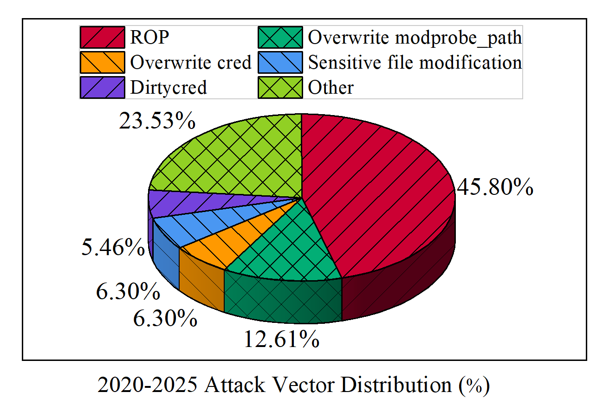
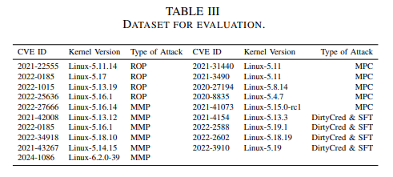
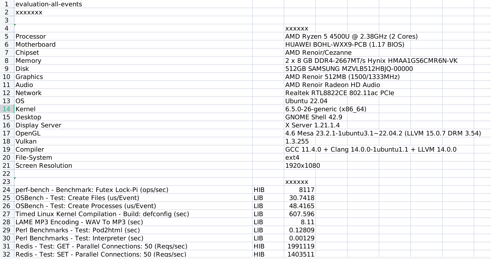
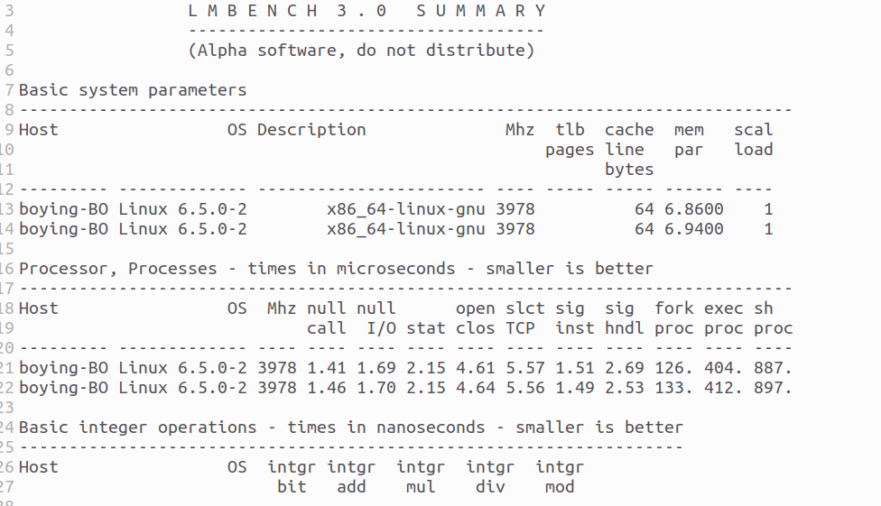

# KShield

**Our paper:** kShield: An eBPF Runtime Defense Framework for Linux Kernel Privilege Escalation Attacks

- `1-func-test`: Validating the effectiveness of kShield's defense mechanisms.
- `2-performance-test`: Measuring the overhead introduced by kShield on the host system using benchmark tests.
- `3-source-code`: Implementation details.

## Abstract

This guide outlines the procedures for both functional and performance testing of kShield.

## Prerequisites

**For functional test:**

- qemu 7.0.0
- open-ssh

**For quickstart and performance test:**

- Kernel debug symbol (`vmlinux-$(uname -r)`) under `/boot` directory
- Kernel Headers (under `/lib/modules` directory)
- BTF type information
- python 3.9+
- Phoenix-Test-Suite 10.8.5
- Lmbench3

## Quickstart

#### Using docker

Try kShield with the command below:

```bash
docker run --name kshield -it --rm \
	--pid=host --cgroupns=host --privileged \
	-v /lib/modules/$(uname -r)/build:/lib/modules/$(uname -r)/build \
	-v /sys/kernel/tracing:/sys/kernel/tracing \
	-v /boot:/boot \
	boying4324/kshield:latest [Arguments]
```

| Argument  | Usage                                    |
| --------- | ---------------------------------------- |
| `--help`  | Print the help list                      |
| `-e[NUM]` | specify enabled events (NUM = 0,1,2,3,4) |
| `-a`      | trace all 5 events                       |

#### Compile and run

Install dependencies

```bash
apt-get update && apt-get install -y --no-install-recommends \
      clang \
      libelf1 \
      libelf-dev \
      zlib1g-dev \
      binutils \
      make \
      llvm \
      build-essential \
```

Enter the source code directory

```bash
cd ./kShield/3-source-code/v0.01/src/libbpf-bootstrap/
```

Compile

```bash
make all 
```

## Statistical Analysis of Publicly Available Exploits

To ensure kShield mitigates prevalent real-world threats, we systematically collected functional Linux kernel privilege escalation exploits publicly released on GitHub from January 2020 to early 2025. This multi-granularity search yielded a comprehensive dataset covering both Control Data Attacks (e.g., ROP) and Non-Control Data Attacks (e.g., DirtyCred, `modprobe_path` manipulation), which drives our evaluation and defense design. 


For transparency and to facilitate future research, our complete exploit tracking results are publicly available:

- [Coarse-grained Exploit Collection Data](https://docs.google.com/spreadsheets/d/1yehQnvRGGu4Cw4nrTmNDF228zIwbEYmkc_KOqTwjXTg)
- [Fine-grained CVE Review (2020-2025)](https://docs.google.com/spreadsheets/d/106PiiCCUNv2OijrR1mlHqk0ln4GDbgJy89Jwjjft4YE)

## Functional Test

We collected vulnerabilities and their exploit existing in real systems from GitHub and CVE platform to evaluate the effectiveness of kShield. The used exploits are listed [here](./1-func-test/Tested-Exploit-List.xlsx). 

**For each exploit listed in the table, we:**

1. **Reproduced the collected exploits** to verify their functionality. Testing confirmed that all 19 exploits mentioned in this paper can successfully trigger the vulnerabilities, carry out attacks, and escalate privileges from a regular user to ROOT.
2. **Deployed kShield in the functional testing environment**, and then launched the attacks using the aforementioned exploits. Testing demonstrated that kShield successfully mitigated all attacks. 

To begin with, download the root file system for functional testing from this [link](https://drive.google.com/file/d/1cv7geSOpTeqLo9jR1Ee50uZy6S93tSFm/view?usp=sharing), and place it in the `./1-func-test/Launch-Func-Test/` directory.

To perform an provided functional test, first start the test VM:

```bash
# Enter the test directory
cd ./1-func-test/Launch-Func-Test/{The_exp_category,e.g.DIRTYCRED}/{CVE_ID}

# Run the test
./start.sh
```

Next, the virtual machine for functional testing will start running. Log in with the username `boying` and password `1`. The kShield executable can be found at `/home/boying/kprobe`. Run `./kprobe --help` to view detailed usage instructions. The collected test exploits are located in the `./exp` directory.

To facilitate the process, you can open two terminal windows and use SSH to connect to the target virtual machine with the following commands:

```bash
# enable VM network(in VM)
sudo ./enable_net.sh

# connect to the VM from the host via ssh
ssh -p 10021 boying@127.0.0.1
```

Once connected, perform the following tests in the two separate terminal windows.

**Test 1:** 

Run the exploit directly and observe whether privilege escalation is successfully achieved. This test verifies the effectiveness of the exploit before deploying kShield.

**Example:**

```bash
# Enter the exploit directory
cd ./exp/rop/CVE-2022-1015

# directly run the exploit
./exploit-2022-1015
```

**Video Demo:**

[](https://youtu.be/QqEbYsvsCRc)

**Test 2:**

After deploying kShield, run the exploit again and observe whether privilege escalation is successfully mitigated. This test evaluates the effectiveness of kShield in protecting against the targeted vulnerability exploit.

**Example:**

```bash
# Deploy kshield
sudo ./kprobe -e{event_num}

# Enter the exploit directory
cd ./exp/rop/CVE-2022-1015

# run the exploit
./exploit-2022-1015
```

**Video Demo:**

[](https://youtu.be/-DZeA90lPR8)

The provided testcases include:



We have recorded a comparison video showing the system before and after kShield deployment. Please refer to this [link](https://drive.google.com/drive/folders/12LLyRELEaQzdKJkEvsaeH3gB85PN4v_p?usp=sharing).

## Performance Test

The performance tests are conducted on the **host machine**, aiming to evaluate the additional overhead introduced by kShield. The tests consist of two parts: micro-benchmarking and macro-benchmarking.

(1) Install `phoronix-test-suite` and `lmbench-3.0-a9`

(2) Place the two folders (i.e. `phoronix-test-suite` and `lmbench-3.0-a9`) at `./2-performance-test/`

(3) Start the performance test with scripts

```bash
# swith to CPU performance mode 
echo performance | sudo tee /sys/devices/system/cpu/cpu*/cpufreq/scaling_governor

# Enter the test directory
cd ./2-performance-test

# start the test
./evaluation.sh
```

**Figure of Test Results:**

Macro-benchmark



Micro-benchmark


